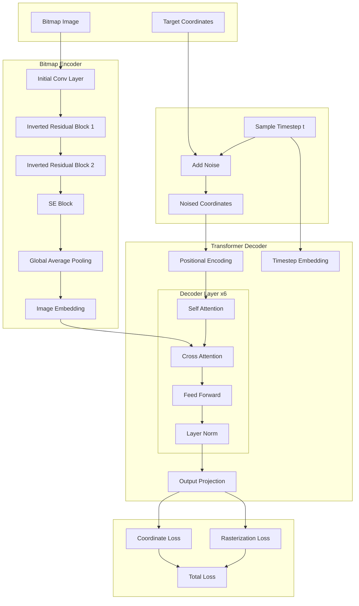

# Nimble: Image-to-Vector Sketch Generation

A diffusion-based model that converts images into vector sketches, inspired by human drawing processes.

## Architecture



## Overview
Nimble takes an input image and generates a vector sketch representation using points and strokes. It employs a diffusion process to gradually denoise random points into a coherent sketch, guided by the input image.

### Key Features
- Converts images to vector sketches (sequences of 2D coordinates)
- Works with any input image size
- Controllable generation via temperature parameter
- Visualizes the generation process step by step

## Installation

```bash
# Clone the repository
git clone https://github.com/jeffasante/nimble.git
cd nimble

# Install package
pip install -e .
```

## Getting the Data

1. Download the Quick, Draw! dataset:
```bash
# Create data directory
mkdir -p data

# Download bird sketches (simplified .ndjson format)
wget https://storage.googleapis.com/quickdraw_dataset/full/simplified/bird.ndjson -O data/bird.ndjson

# Download bird sketches binary format (optional)
wget https://storage.googleapis.com/quickdraw_dataset/full/binary/bird.bin -O data/bird.bin
```

2. Process the data using the provided script:
```python
from dataset import PhotoSketchDataset, save_processed_data

# Create and process dataset
dataset = PhotoSketchDataset('data/bird.ndjson', num_points=100, image_size=28)
save_processed_data(dataset, 'data/processed')
```

## Training

1. Create a training configuration file `train_config.yaml`:
```yaml
data:
  train_path: "data/processed"
  image_size: 28
  num_points: 100
  batch_size: 32

model:
  embed_dim: 256
  diffusion_steps: 1000

training:
  learning_rate: 3e-5
  num_epochs: 100
  validate_every: 1
```

2. Start training:
```python
from train import train_model

train_model(
    data_path='data/processed',
    batch_size=32,
    num_epochs=100
)
```

The training script will:
- Save checkpoints to the `checkpoints` directory
- Display progress with tqdm
- Log training and validation metrics
- Save the best model based on validation loss

## Inference

```python
from nimble.inference import NimbleInference

# Initialize model
inferencer = NimbleInference(
    checkpoint_path="checkpoints/best_model/checkpoint_0",
    image_size=(28, 28),
    num_points=100
)

# Generate single sketch
coords = inferencer.generate(
    "test_images/bird_0.jpg",
    temperature=0.8  # Controls randomness (lower = more precise)
)

# Visualize generation process
inferencer.visualize_generation(
    "test_images/bird_0.jpg",
    temperature=0.8,
    num_steps=5
)
```

## Project Structure
```
deploy-jax/
├── architecture-diagram.mermaid   # Architecture visualization
├── checkpoints/                   # Model checkpoints
├── test_images/                   # Sample test images
├── dataset.py                     # Data loading and processing
├── decoder.py                     # Transformer decoder implementation
├── diffusion.py                   # Diffusion process implementation
├── encoder.py                     # MobileNetV3-based image encoder
├── inference.py                   # Inference and visualization
├── losses.py                      # Training loss functions
├── train.py                       # Training loop and validation
├── play.ipynb                     # Interactive examples notebook
├── readme.md                      # Project documentation
├── setup.py                       # Package installation configuration
```

## Technical Details

### Architecture Components
- **Bitmap Encoder**: MobileNetV3-based network for processing input images
- **Transformer Decoder**: Converts noised coordinates to sketch points
- **Diffusion Process**: Manages the denoising sequence
- **Loss Functions**: 
  - Coordinate loss (L2)
  - Rasterization loss (Binary Cross-Entropy)

### Model Parameters
- Input Resolution: 28×28 pixels
- Output: 100 2D coordinates
- Embedding Dimension: 256
- Diffusion Steps: 1000

### Requirements
```
jax>=0.4.27
flax>=0.1.0.3
optax>=0.2.4
numpy>=1.23.2
Pillow>=10.0.0
matplotlib>=3.7.0
tqdm>=4.65.0
```

## Citation

If you use this code in your research, please cite:

```bibtex
@software{nimble2025,
  author = {Jeffrey Oduro Asante},
  title = {Nimble: Image-to-Vector Sketch Generation},
  year = {2025},
  url = {https://github.com/jeffasante/nimble}
}
```